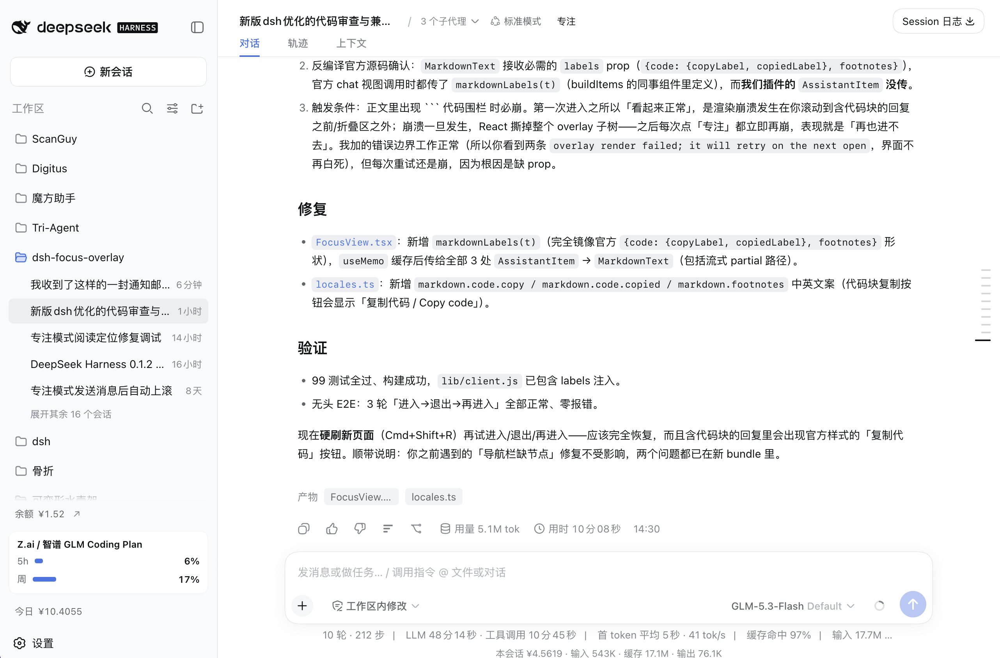
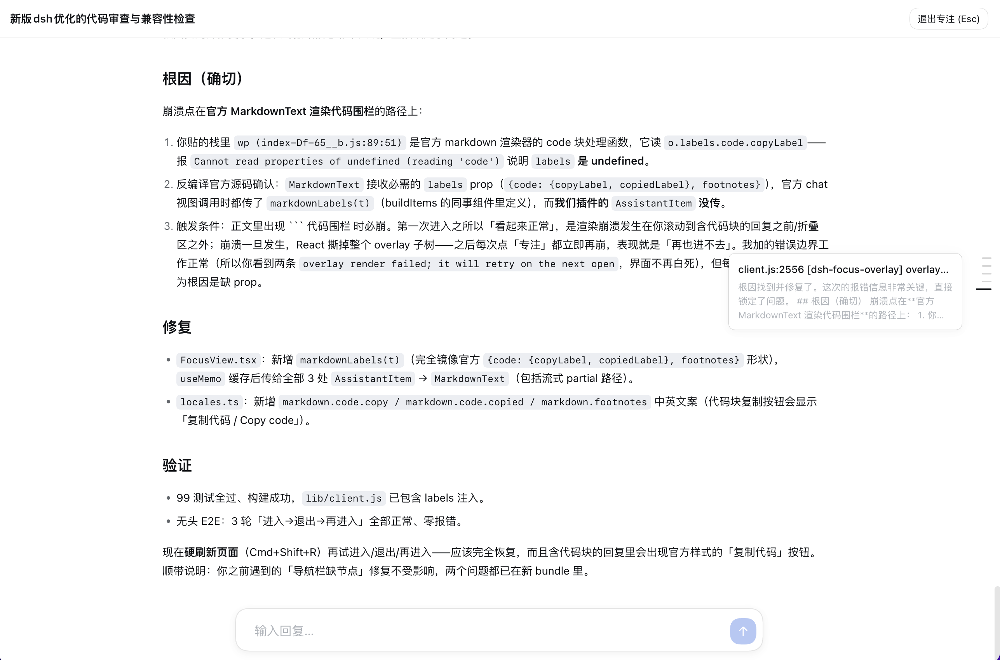

<h1 align="center">dsh-focus-overlay</h1>

<p align="center">
  <a href="README.md">中文</a> | English
</p>

<p align="center">
  A <b>focus mode</b> for the DeepSeek Harness (DSH) web GUI: one click to a full-screen reading view that hides the header and composer and folds the AI tool-call flow into a one-line summary — leaving only the conversation between you and the AI.<br>
  Text and image rendering reuse the official primitives, matching the chat view 1:1.
</p>

<p align="center">
  
  
  
</p>

## Features

- **Full-screen display** — covers the whole UI, giving all vertical space to the conversation
- **Hide the header and composer** — a thin top bar remains, the input area is tucked away
- **Fold tool calls** — an assistant turn collapses into a one-line summary
- **Quick navigation** — a right-side node navbar with hover preview and click-to-jump
- **Auto-focus & reminders** — after a reply completes, optionally auto-enter focus at your question; while in focus, get a toast for a new reply or when the AI is waiting on you

These features are designed to give **small screens** more content space: tucking away the persistent header/composer and tool steps lets the conversation use as much of the screen as possible.

## Screenshots

**Off — the normal chat view**



**On — focus mode**



<!-- Drop your screenshots into screenshots/:
     - before.png — the normal chat view (header / composer / tool cards)
     - after.png  — focus mode (full-screen overlay + summary line + right-side navbar)
     Optionally add navbar.png as a navbar close-up. -->

Once in focus mode, an assistant turn no longer shows every step — it folds into a single summary line:

> ran 2 commands, edited 3 files, read 5 files, ran 1 search

## Capabilities

| Feature | Description |
| --- | --- |
| Full-screen overlay | Registered into `shell.overlay` (additive, `replaceRisk: none`) — covers header / composer / sidebar, giving all vertical space to the conversation |
| Official rendering | Assistant text through official `MarkdownText` (GFM + code highlighting + TeX); user messages through `MessageText`; user bubble uses the official blue, borderless style |
| Image resolution | Assistant `image` blocks resolve through `conversation.resolveImage`, rendering session-authorized images 1:1 |
| Tool-call folding | Tool calls / commands / context injections fold into a categorized summary line (commands / edits / searches / reads / directory listings / subagents / todos / goals / workflows / skills / questions / plans / background jobs) |
| Precise scroll preservation | Opens at the message you're reading in the chat (aligned by `seq`), not from the top |
| Right-side node navbar | One dot per user message; active pill follows scroll, hover preview, click to jump, auto-hidden under 2 messages |
| Back to latest | A centered "↓ back to latest" floating button appears when you scroll away from the bottom |
| File mentions | Wires `chatFileMentions`, turning inline-code tokens that name real files into clickable links |
| i18n | Chinese / English copy, follows the UI language |
| Plugin configuration card | A collapsible card under "Settings → Plugins → Plugin configuration": navbar toggle, open-position strategy, text-area width — persisted to `localStorage` |
| Auto-enter focus | After a reply **completes normally**, auto-open focus at your question; abnormal endings (stop / error / max-tokens / interrupt) never fire |
| Reply / waiting reminders | In focus, a "New reply ready + View" toast on completion; an "AI is waiting for your reply + Reply" toast on a question/approval, auto-cleared once answered |
| DSH-better-sidebar compatibility | While in focus, auto-hide its top-right panel toggle buttons and any open right/bottom panels (and release the squeezed layout); restored on exit |

## Install

Requires the `dsh` CLI (`>= 0.1.0-rc.5`).

**From npm (recommended)**

```sh
dsh plugin --profile web add dsh-focus-overlay
dsh web
```

> If `add` doesn't install the latest version, pnpm's `minimumReleaseAge` (minimum release age) security policy is at work: by default it won't resolve a version as `latest` within **24 hours** of publication, falling back to the previous stable release. To install the latest immediately, pin the version explicitly:
>
> ```sh
> dsh plugin --profile web add dsh-focus-overlay@<version>
> ```
>
> Or wait 24 hours, then re-run the plain `add` command.

**From GitHub**

```sh
dsh plugin --profile web add github:boogoo619/dsh-focus-overlay
dsh web
```

> A git install pulls the **source** and builds it in place via the `prepare` script. pnpm ≥10 refuses to run `prepare` until you allow it; the first `add` fails, then follow the `dsh` hint and add the exact package key to that profile's `pnpm-workspace.yaml`:
>
> ```yaml
> allowBuilds:
>   dsh-focus-overlay: true
> ```
>
> Then re-run `add`. **This authorization lets the package's code run on your machine at install time** — only grant it to sources you trust, and pin the commit (`github:boogoo619/dsh-focus-overlay#<sha>`).

Restart `dsh web` after install.

## Usage

1. Open a session and click the **"Focus"** button in the session header action row.
2. You enter the full-screen focus view: a thin top bar (session title + exit) and the conversation only, with tool steps folded into summary lines.
3. Hover the right-side dots to preview, click to jump; a centered "↓ back to latest" button appears when you're not at the bottom.
4. Press `Esc` or click "Exit focus" to return — the original UI is untouched.

> **Compatibility note**: if [DSH-better-sidebar](https://github.com/omdsh-dev/DSH-better-sidebar) is also installed, entering focus mode auto-hides its two top-right panel toggle buttons and any open right/bottom panels (releasing the squeezed layout); they're restored as they were on exit, without touching that plugin's layout state.

## Settings

In the sidebar "Settings → Plugins → Plugin configuration", expand the "Focus Mode" card:

| Option | Description |
| --- | --- |
| Show right-side navbar | Toggle the nav dots (default on) |
| Preserve chat position on open | Open at your current reading position; off opens at the latest (default on) |
| Text width | 480–1200px slider for the reading column (default 760px) |
| Auto-enter focus mode when a reply completes | On a normal completion: auto-open at your question when closed, or a "New reply ready" toast when open; an "AI is waiting" toast on a question/approval (default off) |

## License

[MIT](./LICENSE)
